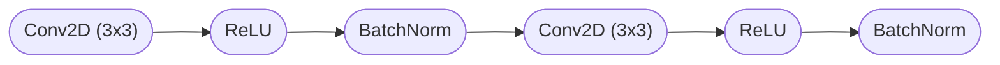
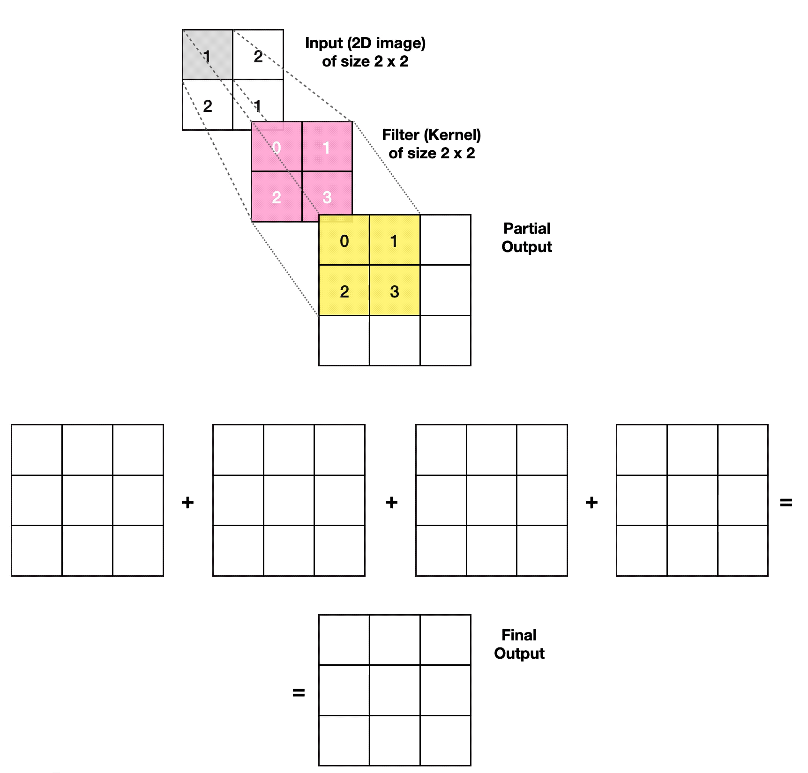

# U-Net

## 1. Overview

Với nhu cầu về một mô hình phân đoạn ảnh mạnh mẽ, nhanh chóng, và chính xác trong lĩnh vực y tế. Đối mặt với việc thiếu dữ liệu trong các bài toàn cụ thể (như ảnh y tế). Chính những điều này thôi thúc tác giả paper tạo ra một kiến trúc có thể học các đặc trưng ở nhiều cấp độ khác nhua để phân đoạn chi tiết và toàn diện. Và U-Net ra đời

U-Net là một kiến trúc mạng nơ-ron tích chập (CNN), như tên gọi thì cấu trúc mạng có hình chữ U, được thiết kế đặc biệt cho các bài toán phân đoạn ảnh. Ban đầu được giới thiệu cho ảnh y tế (như MRI, CT scans), sau này được ứng dụng vào ảnh vệ tinh và ảnh công nghiệp . Mạng này nổi tiếng nhờ khả năng tạo ra phân vùng chính xác cao với số lượng mẫu huấn luyện ít.

**Các biến thể (Variants)**

* **3D U-Net**: Mở rộng U-Net cho dữ liệu 3D như ảnh CT, MRI 3 chiều.
* **Attention U-Net**: Thêm các cơ chế attention để tập trung vào các vùng quan trọng.
* **ResUNet**: Kết hợp residual blocks để cải thiện hiệu suất và ổn định gradient.

## 2. Cấu trúc

<figure><figcaption></figcaption></figure>

U-Net có cấu trúc đặc trưng hình chữ U với hai phần chính:

* **Đường dẫn thu nhỏ( Contracting Path)**: nhằm giảm kích thước không gian của hình ảnh, đồng thời thu thập thông tin liên quan về hình ảnh.
* **Đường mở rộng(Expanding path)**: nhắm đến việc tăng cường độ phân giải của bản đồ đặc trưng và tạo ra bản đồ phân đoạn liên quan bằng cách sử dụng các mẫu đã học trong đường co lại.

Như bạn có thể nhận thấy, U-Net thực sự giống với kiến trúc **encoder-decoder**, tình cờ tạo thành hình chữ **U**, do đó có tên gọi này. Nó đối xứng nhau cả về số tầng lẫn cấu trúc, tạo nên sự cân bằng trong việc trích xuất và tái tạo đặc trưng

### 2.1 Encoder (Contracting Path)

Contracting Path trong U-Net là nửa bên trái của kiến trúc hình chữ U, chịu trách nhiệm nắm bắt ngữ cảnh và các đặc trưng ở các mức trừu tượng khác nhau.

<figure><figcaption></figcaption></figure>

Nó hoạt động tương tự như một mạng nơ-ron tích chập điển hình, bao gồm các bước sau lặp lại:

* Tích chập: Hai lớp tích chập 3x3 (không có phần đệm) được áp dụng để trích xuất đặc trưng không gian từ ảnh đầu vào.&#x20;
* ReLU: Hàm kích hoạt ReLU (Rectified Linear Unit) được sử dụng sau mỗi lớp tích chập để đưa vào tính phi tuyến cho mô hình.&#x20;
* Max Pooling: Hoạt động gộp tối đa kernel size 2x2 với bước (stride) = 2 được sử dụng để giảm kích thước của không gian đặc trưng, đồng thời tăng trường nhìn của mạng.&#x20;
* Tăng gấp đôi số kênh: Ở mỗi bước giảm mẫu, số kênh đặc trưng được tăng gấp đôi để nắm bắt thông tin chi tiết hơn ở các mức trừu tượng cao hơn.

Ta có thể rút ra được công dụng của Contracting path ngoài việc trích xuất đặc trưng, giảm kích thước ma trận mà còn nắm bắt được ngữ cảnh bằng cách giảm mẫu và tăng số kênh, đường dẫn sẽ co lại giúp mô hình nắm bắt ngữ cảnh rộng hơn của ảnh đầu vào, cho phép nó hiểu được mối quan hệ giữa các vùng khác nhau trong anh

### 2.2 Bottleneck

Bottleneck thường được thiết kế với 2 hoặc nhiều lớp tích chập liên tiếp 3×3 với hàm kích hoạt **ReLU** và cơ chế **Batch Normalization** để học sâu hơn các đặc trưng quan trọng và đảm bảo sự ổn định và chuẩn hóa dữ liệu

<figure><figcaption></figcaption></figure>

Cấu trúc cơ bản của bottleneck:

Vai trò của Bottleneck: &#x20;

* Nắm bắt thông tin ngữ cảnh toàn cục: Độ phân giải thấp và số kênh cao cho phép bottleneck nắm bắt thông tin ngữ cảnh toàn cục của ảnh đầu vào.&#x20;
* Học các đặc trưng trừu tượng: Bottleneck học các đặc trưng trừu tượng và phức tạp đại diện cho các mẫu và mối quan hệ trong toàn bộ ảnh.&#x20;
* Cung cấp thông tin ngữ cảnh cho phân đoạn: Thông tin ngữ cảnh được bottleneck nắm bắt sẽ được truyền sang đường dẫn mở rộng để hỗ trợ việc bản địa hóa chính xác các đối tượng trong quá trình phân đoạn.

Tóm lại: Bottleneck là một thành phần quan trọng trong kiến trúc U-Net, đóng vai trò cầu nối thông tin ngữ cảnh giữa hai đường dẫn và giúp mô hình học các đặc trưng trừu tượng đại diện cho toàn bộ ảnh.

### 2.3 Decoder ( **Expanding path**)

**Expanding Path** trong U-Net là nửa bên phải của kiến trúc hình chữ U, đóng vai trò tăng kích thước bản đồ đặc trưng và kết hợp thông tin ngữ cảnh từ đường dẫn co lại để tạo ra phân đoạn chính xác

<figure><figcaption></figcaption></figure>

Nó hoạt động bằng cách thực hiện các bước sau lặp lại:&#x20;

* **Up-Sampling (Tăng kích thước không gian)**: Sử dụng phép "tích chập lên" (up-convolution) 2x2 để tăng gấp đôi kích thước của bản đồ đặc trưng.&#x20;
* **Skip Connections (Kết nối tắt)**: Kết hợp bản đồ đặc trưng được nâng mẫu với bản đồ đặc trưng tương ứng từ đường dẫn co lại, cung cấp thông tin ngữ cảnh có độ phân giải cao cho việc phân đoạn.&#x20;
* **Convolutional Layers (Tích chập)**: Hai lớp tích chập 3x3 được áp dụng để tinh chỉnh và kết hợp thông tin từ bản đồ đặc trưng được nối kết.&#x20;
* **Activation Function (Hàm kích hoạt)**: Hàm kích hoạt ReLU được sử dụng sau mỗi lớp tích chập để đưa vào tính phi tuyến cho mô hình.&#x20;
* Giảm một nửa số kênh: Ở mỗi bước **Tăng kích thước không gian**, số kênh đặc trưng được giảm một nửa để phù hợp với kích thước của bản đồ đặc trưng từ đường dẫn co lại.

## &#x20;3. Up-Convolutions&#x20;

**Up-Convolutions**, còn được gọi là **Transposed Convolutions** hoặc **Deconvolutions**, là một phần quan trọng trong U-Net, đặc biệt trong **Decoder (Expanding Path)**. Chúng có nhiệm vụ tăng kích thước không gian của đặc trưng (spatial dimensions) trở về như kích thước ảnh ban đầu, đồng thời tái tạo các chi tiết từ các đặc trưng trừu tượng được học từ phần **Encoder**.

<figure><figcaption>
<a href="https://towardsdatascience.com/transposed-convolutional-neural-networks-how-to-increase-the-resolution-of-your-image-d1ec27700c6a">Nguồn</a>
</figcaption></figure>

Giả sử đầu vào là một Tensor X với kích thước $$H\text{x}W\text{x}C$$, sau khi qua up-convolution với kernel 𝐾 , stride 𝑆 , và padding 𝑃. Kích thước đầu ra được tính như sau:

$$
\text{Output size}= S.(H-1)+K-2.P
$$

### 3.1 Nguyên lý hoạt động

Up-Convolutions có cơ chế hoạt động ngược với các **Convolutions thông thường**. Thay vì giảm kích thước không gian (down-sampling), chúng tăng kích thước không gian (up-sampling) của đặc trưng, cụ thể:

* **Thêm các khoảng trống giữa các pixel** bằng cách thêm các giá trị zero (zero padding) giữa các pixel hiện có để tăng kích thước đặc trưng
* **Áp dụng convolution kernel** để "tính toán và điền đầy" giá trị cho các khoảng trống, tạo ra đặc trưng lớn hơn với thông tin phù hợp.

