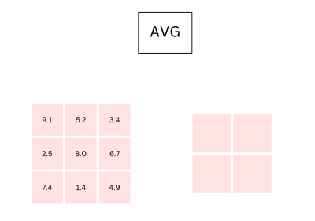
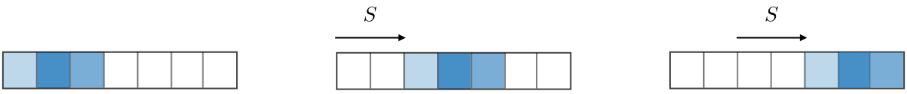
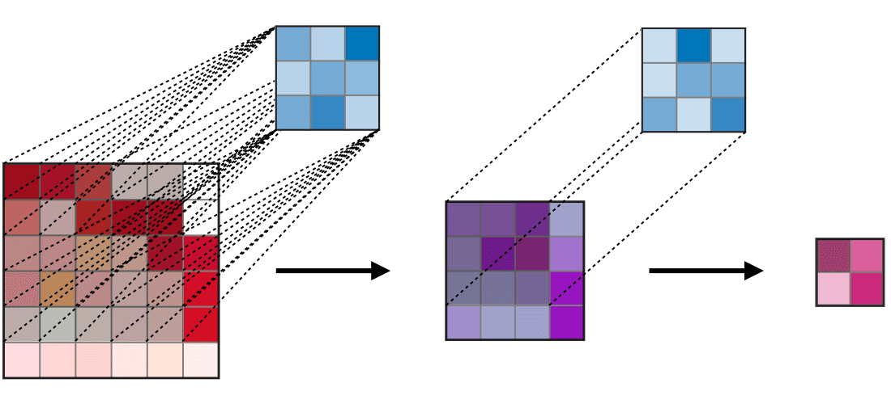

# CNN

## 1. Overview

**Kiến trúc truyền thống của CNN** - Convolutional neural network (Mạng lưới thần kinh tích chật ), còn được gọi là CNN, là một loại neural network (Mạng thần kinh) cụ thể và nó thường bao gồm các lớp sau:

<figure><figcaption></figcaption></figure>

Lớp tích chập (convolution layer) và lớp gộp (pooling layer) có thể được điều chỉnh liên quan các siêu tham số được mô tả trong các phần tiếp theo&#x20;

## 2. Các loại lớp

### 2.1 Tầng tích chập (CONV)

Tầng tích chập (CONV) sử dụng các bộ lọc để thực hiện phép tích chập khi đưa chúng đi qua đầu vào I (input) theo các chiều của nó. Các siêu tham số của bộ lọc này bao gồm kích thước bộ lọc F (filter) và độ trượt S (stride). Kết quả đầu ra O (output) được gọi là feature map hay activation map

<figure><figcaption></figcaption></figure>

_Lưu ý: Bước tích chập cũng có thể được khái quát hóa cả với trường hợp một chiều (1D) và 3 chiều (3D)._

### 2.2 Pooling(POOL)

Tầng pooling(POOL) là một phép downsampling, thường được sử dụng sau tầng tích chập, giúp tăng tính bất biến không gian. Cụ thể max pooling và average pooling là những dạng pooling đặc biệt, mà tương ứng là trong đó giá trị lớn nhất và giá trị trung bình được lấy ra&#x20;

<table data-full-width="true"><thead><tr><th width="147">Kiểu</th><th>Max Pooling</th><th>Average Pooling</th></tr></thead><tbody><tr><td>Chức năng</td><td>Từng phép pooling chọn giá trị lớn nhất trong khu vực</td><td>Từng phép pooling tính trung bình các giá trị trong khu vực mà nó đang được áp dụng</td></tr><tr><td>Minh họa</td><td></td><td></td></tr><tr><td>Nhận xét</td><td><ul><li>Bảo toàn các đặc trưng đã phát hiện</li><li>Được sử dụng thường xuyên</li></ul></td><td><ul><li>Giảm kích thước feature map</li><li>Được sử dụng trong mạng LeNet</li></ul></td></tr></tbody></table>

### 2.3 Fully Connected (FC)

Tầng kết nối đầy đủ (FC) nhận đầu vào là các dữ liệu đã được làm phẳng, mà mỗi đầu vào đó được kết nối đến tất cả neuron. Trong mô hình mạng CNNs, các tầng kết nối đầy đủ thường được tìm thấy ở cuối mạng và được dùng để tối ưu hóa mục tiêu của mạng ví dụ như độ chính xác của lớp

<figure><figcaption></figcaption></figure>

## 3. Các siêu tham số của bộ lọc

Tầng tích chập chứa các bộ lọc mà rất quan trọng cho ta khi biết ý nghĩa đằng sau các siêu tham số của chúng&#x20;

### 3.1 Các chiều của một bộ lọc&#x20;

Một bộ lọc kích thước $$F\text{ x }F$$áp dụng lên đầu vào chứa C kênh (channel) thì có kích thước tổng kể là $$F \text{ x } F \text{ x } C$$ thực hiện phép tích chập trên đầu vào kích thước $$I \text{ x } I \text{ x } C$$ và cho ra một feature map(hay còn gọi là activation map ) có kích thước $$O \text{ x } O \text{ x } 1$$.

<figure><figcaption></figcaption></figure>

_Lưu ý : việc áp dụng K bộ lọc có kích thước_ $$F \text{ x }F$$ _cho ra một feature map có kích thước_ $$O \text{ x } O \text{ x } K$$

### 3.2 Stride&#x20;

Đối với phép tích chập hoặc phép pooling, độ trượt S ký hiệu số pixel mà cửa sổ sẽ di chuyển sau mỗi lần thực hiện phép tính

<figure><figcaption></figcaption></figure>

### 3.3 Zero Padding

Zero Padding là tên gọi của quá trình thêm P số không vào các biên của đầu vào. Giá trị này có thể được lựa chọn thủ công hoặc một cách tự động bằng một trong ba những phương pháp mô tả bên dưới:&#x20;

<table data-full-width="true"><thead><tr><th width="164">Phương pháp</th><th>Valid</th><th>Same</th><th>Full</th></tr></thead><tbody><tr><td>Giá trị</td><td>P=0</td><td>P_{start}= \begin{bmatrix} \frac{S[\frac{I}{S}]-I+F-S}{2} \end{bmatrix} P_{end}= \begin{bmatrix} \frac{S[\frac{I}{S}]-I+F-S}{2} \end{bmatrix}</td><td>P_{start} \in[0,F-1] P_{end}=F-1</td></tr><tr><td>Minh họa</td><td></td><td></td><td></td></tr><tr><td>Mục đích</td><td><ul><li>Không sử dụng padding</li><li>Bỏ phép tích chập cuối nếu số chiều không khớp</li></ul></td><td>
• Sử dụng padding để làm cho feature map có kích thước \begin{bmatrix} \frac{I}{S} \end{bmatrix}

• Kích thước đầu ra thuận lợi về mặt toán học 

• Còn được gọi là 'half' padding
</td><td><ul><li>Padding tối đa sao cho các phép tích chập có thể được sử dụng tại các rìa của đầu vào </li><li>Bộ lọc "thấy " được đầu vào từ đầu đến cuối</li></ul></td></tr></tbody></table>

## 4. Điều chỉnh các siêu tham số

### 4.1 Tính tương thích của tham số trong tầng tích chập

Công thức:

$$
O= \frac{I- F+P_{start} +P_{end}}{S}+1
$$

* I là độ dài kích thước đầu vào
* F là độ dài bộ lọc
* P là số lượng zero padding
* S là độ trượt
* O là độ dài output của feature map

<figure><figcaption></figcaption></figure>

Lưu ý: Trong một số trường hợp , $$P_{start}=P_{end}=P$$, ta có thể thay thế $$P_{start}+P_{end}$$ bằng $$2P$$ trong công thức trên

### 4.2 Hiểu về độ phức tạp của mô hình

Để đánh giá độ phức tạp của một mô hình, cách hữu hiệu là xác định số tham số mà mô hình đó sẽ có. Trong một tầng của mạng neural tích chập, nó sẽ được tính toán như sau:

<table data-full-width="true"><thead><tr><th width="139"></th><th>CONV</th><th>POOL</th><th>FC</th></tr></thead><tbody><tr><td>Minh họa</td><td></td><td></td><td></td></tr><tr><td>Kích thước đầu vào</td><td>I\text{ x }I\text{ x }C</td><td>I\text{ x }I\text{ x }C</td><td>N_{in}</td></tr><tr><td>Kích thước đầu ra</td><td>O\text{ x }O\text{ x }K</td><td>O\text{ x }O\text{ x }C</td><td>N_{out}</td></tr><tr><td>Số lượng tham số</td><td>(F\text{ x }F\text{ x }C+1).K</td><td>0</td><td>(N_{in}+1)\text{ x }N_{out}</td></tr><tr><td>Lưu ý</td><td>
• Một tham số bias với mỗi bộ lọc 

• Trong đa số trường hợp,  S &#x3C; F

• Một lựa chọn phổ biến cho K là 2C
</td><td><ul><li>Phép pooling được áp dụng lên từn kênh (chanel - wise)</li><li>Trong đa số trường hợp, S=F</li></ul></td><td><ul><li>Đầu vào được làm phẳng</li><li>Mỗi Neuron có một tham số bias </li><li>Số Neuron trong một tần FC phục thuộc vào ràng buộc kết cấu</li></ul></td></tr></tbody></table>

### 4.3 Trường thục cảm (Receptive field)

Trường thụ cảm tại tầng k là vùng được ký hiệu $$R_k\text{ x }R_k$$ của đầu vào mà những pixel của activation map thứ k có thể "nhìn thấy". Bằng cách gọi $$F_j$$ là kích thước bộ lọc của tầng $$j$$ và $$S_i$$ là giá trị độ trượt của tầng i và để thuận tiện, ta mặc định $$S_0=1$$, trường cảm tụ cảm của tầng $$k$$ được tính toán bằng công thức

$$
R_k=1+\displaystyle{\sum_{j=1}^k(F_j-1 )\prod_{i=0}^{j-1}S_i}
$$

_Trong ví dụ bên dưới , ta có_ $$F_1=F_2=3$$ và $$S_1=S_2=1$$, nên cho ra được $$R_2=1+2.1+2.1=5$$

<figure><figcaption></figcaption></figure>

## 5. Các hàm kích hoạt thường gặp

### 5.1 Rectified Linear Unit&#x20;

Tầng rectified linear Unit (ReLU) là một hàm kích hoạt g được sử dụng trên tất cả các thành phần. Mục đích của nó là tăng tính phi tuyến tính cho mạng. Những biến thể khác của ReLU được tổng hợp ở bảng dưới:

<table data-full-width="true"><thead><tr><th>ReLU</th><th>Leaky ReLU</th><th>ELU</th></tr></thead><tbody><tr><td>f(x)= max(0,x)</td><td>f(x)= \begin{cases}  x,\text{ nếu } x>0\cr \beta x, \text{ nếu }x\le0 \end{cases} \beta: Một giá trị nhỏ (thường là 0.01 ) giúp gradient không bằng 0 khi đầu vào âm</td><td>f(x)= \begin{cases} x,\text{ nếu } x>0 \cr \beta(e^x-1)\text{ nếu }x\le 0 \end{cases} \beta: Một hằng số dương (thường là 1)</td></tr><tr><td></td><td></td><td></td></tr><tr><td><ul><li>Dễ tính toán, nhanh</li><li>Giảm thiểu vấn đề Vanishing gradient</li></ul></td><td><ul><li>Khắc phục Dying ReLU</li><li>Đơn giản và nhanh </li></ul></td><td>Khả vi tại mọi nơi</td></tr></tbody></table>

### 5.2 Softmax&#x20;

Với ưu điểm chuẩn hóa đầu ra thành xác suất (tổng =1). Softmax thường được sử dụng ở Output layer cho bài toán phân loại nhiều lớp (Multi-class classification).&#x20;

Softmax có thể được coi là một hàm logistic tổng quát lấy đầu vào là một vector chứa các giá trị $$x \in \R^n$$ và cho ra là một vector gồm các xác suất $$p \in \R^n$$ thông qua một hàm softmax ở cuối kiến trúc

<figure><figcaption></figcaption></figure>

