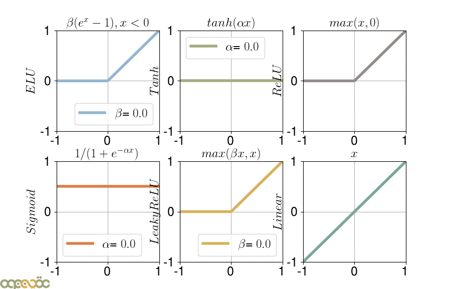
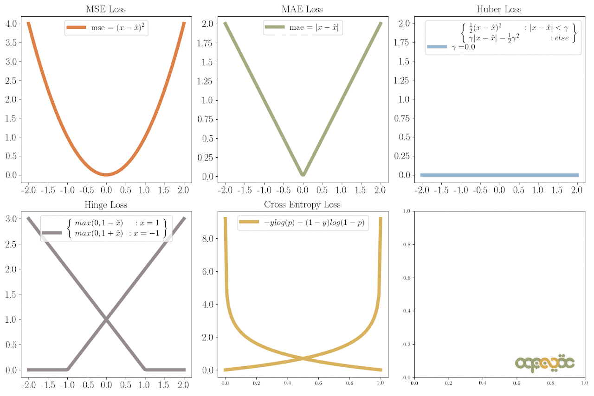

# Neural Networks

Neural Network (Mạng lưới thần kinh) là một lớp các mô hình được xây dựng với các lớp. Các loại mạng lưới thân kinh thược được sử udjng bao gồm các Mạng thần kinh tích chập(CNN) và Mạng lưới thần kinh lặp lại(RNN)

## 1. Tổng quan

Neural Network: Mô hình toán học lấy cảm hứng từ cách hoạt động của não bộ, gồm các neurons liên kết tạo thành một mạng. Với mục tiêu là để tìm ra ánh xạ từ input đến out put thông qua các trọng số weight được học từ dữ liệu

<figure><figcaption>
Source: https://askabiologist.asu.edu/neuron-anatomy
</figcaption></figure>

## 2. Kiến trúc

### 2.1 Thành phần chính

| Layer        | Nhiệm vụ                         | Size                                                                              |
| ------------ | -------------------------------- | --------------------------------------------------------------------------------- |
| Input Layer  | Nhận dữ liệu đầu vào             | Số neuron = số đặc trưng(Features)                                                |
| Hidden layer | Thực hiện các tính toán phức tạp | tùy thuộc bài toán                                                                |
| Output Layer | Cung cấp đầu ra cuối cùng        | <ul><li>Regression: 1 neuron</li><li>Classification: số neurons= số lớp</li></ul> |

<figure><figcaption></figcaption></figure>

### 2.2 Công thức tổng quát

$$
z= \displaystyle{\sum_{i=1}^{n}}w_i x_i +b
$$

$$
a=\sigma(z)
$$

$$x_i$$: Đầu vào\
$$w_i$$: Trọng số\
$$b$$: Bias\
$$\sigma$$: Hàm kích hoạt.

<figure><figcaption></figcaption></figure>

### 2.3 Công thức tính toán giữa các layer

#### Công thức cơ bản

$$
Params=n_{input} ×n_{output} +n_{output}
​
$$

* $$n_{input}​×n_{output}$$​: Trọng số (weights).
* $$n_{output}$$​: Bias.

#### Công thức tính Batch Size và Kích thước Layer

$$
\text{Shape Output}=(B,n_{output})
$$

## 3. Activation Funciton(Hàm kích hoạt)

Các hàm kích hoạt được sử dụng ở cuối một hidden layer để đưa ra độ phức tạp phi tuyến sinh cho mô hình. Dưới đây là những cái phổ biến

<figure><figcaption></figcaption></figure>

<table data-full-width="true"><thead><tr><th width="180">Tên</th><th>Công thức</th><th>Ưu điểm </th><th>Nhược điểm </th><th>Sử dụng</th></tr></thead><tbody><tr><td>Linear </td><td>f(x)=x</td><td>Đơn giản</td><td>Không thêm phi tuyến tính, không thể học các quan hệ phức tạp</td><td>Thường dùng trong output layer cho bài toán hồi quy</td></tr><tr><td>Sigmoid</td><td>f(x) = \frac{1}{1+e^{-x}}</td><td>Phù hợp cho các bài toán phân loại nhị phân</td><td><ul><li>Gradient rất nhỏ ở đầu ra khi giá trị lớn hoặc nhỏ quá</li><li>Tốn tài nguyên tính toán(sử dụng hàm mũ)</li></ul></td><td>Với Output range: (0, 1), hàm này thường được sử dụng cho output layer cho bài toán phân loại nhị phân</td></tr><tr><td>ReLU(Rectified Linear Unit)</td><td>f(x)= max(0,x)</td><td><ul><li>Dễ tính toán, nhanh</li><li>Giảm thiểu vấn đề Vanishing gradient</li></ul></td><td>Dying ReLU problem: Neurons có thể chết (Trọng số không cập nhật nếu đầu ra luôn =0 )</td><td>Với Output range: [0, \infin), hàm này thường được sử dụng cho Hidden layers trong hầu hết các mô hình hiện đại</td></tr><tr><td>Leaky ReLU</td><td>
f(x)= \begin{cases}  x,\text{ nếu } x>0\cr \beta x, \text{ nếu }x\le0 \end{cases} \beta: Một giá trị nhỏ (thường là 0.01 ) giúp gradient không bằng 0 khi đầu vào âm

</td><td><ul><li>Khắc phục Dying ReLU: đầu vào âm thì Leaky ReLU vẫn tạo ra gradient nhỏ ( \beta x ), cho phép các neurons có thể được học tiếp</li><li>Đơn giản và nhanh: tính toán tương tự ReLU, không đòi hỏi tài nguyên</li></ul></td><td><ul><li>Không cố định: Giá trị \alpha cần được chọn cẩn thận (thường được thiết lập thủ công)</li><li>Không đảm bảo tính trung tâm</li></ul></td><td>Hidden layers trong các mô hình học sâu, khi gặp vấn đề Dying ReLU</td></tr><tr><td>ELU(Exponential Linear Unit)</td><td>f(x)= \begin{cases} x,\text{ nếu } x>0 \cr \beta(e^x-1)\text{ nếu }x\le 0 \end{cases}\beta: Một hằng số dương (thường là 1)</td><td><ul><li>Tính đối xứng quanh 0</li><li>Khắc phục Dying ReLU</li><li>Cải thiện học sâu: ELU có gradient lớn hơn ở phần âm so với Leaky ReLU, giúp cập nhật trọng số hiệu quả hơn</li></ul></td><td><ul><li>
Tốn tài nguyên: Việc tính toán exp(x) phức tạp hơn so với các phép tính cơ bản trong ReLU hoặc Leaky ReLU
<ul><li>Cần chọn \beta </li></ul></li></ul></td><td>Các mạng yêu cầu xử lý gradient ổn định hơn. Các mạng học sâu phức tạp như CNN RNN</td></tr><tr><td>Tanh</td><td>f(x)= \frac{e^x-e^{-x}}{e^x+e^{-x}}</td><td>Output có giá trị trung tâm là 0</td><td>Vấn đề gradient vanishing</td><td>Hidden layers trong các bài toán yêu cầu đầu ra từ -1 đến 1</td></tr></tbody></table>

## 4. Training process (Quá trình huấn luyện)

<figure><figcaption>
<a href="https://medium.com/data-science-365/overview-of-a-neural-networks-learning-process-61690a502fa">https://medium.com/data-science-365/overview-of-a-neural-networks-learning-process-61690a502fa</a>
</figcaption></figure>

### 4.1 Forward Progation

Forward Progation (Lan truyền xuôi) là quá trình tính toán từ input đến output qua các layers theo thứ tự như ảnh. Tại lớp đầu ra , mạng tạo ra kết quả dự đoán $$y_{hat}$$(predictions)

### 4.2 Loss Function

Loss Function (Hàm mất mát) đo lường sự khác biệt giữa giá trị dự đoán $$y_{hat}$$ và giá trị thực $$y$$

Dưới đây là top 5 các hàm mất mát được sử dựng nhiều&#x20;

#### Regression Losses

<table data-full-width="true"><thead><tr><th>Tên</th><th>Công thức</th><th>Ưu điểm </th><th>Nhược điểm </th></tr></thead><tbody><tr><td>MSE (Mean Squared Error)</td><td>MSE= \frac{1}{n}\displaystyle{\sum_{i=1}^n} (y_i-\hat{y_i})^2</td><td>Nhạy cảm với sai số lớn (do bình phương)</td><td>Tập trung quá mức vào việc giảm thiểu các sai số lớn, có thể dẫn đến overfitting nếu dữ liệu có nhiều ngoại lệ</td></tr><tr><td>MAE(Mean Absolute Error)</td><td>MAE= \frac{1}{n}\displaystyle{\sum_{i=1}^{n}}|y_i- \hat{y_i}|</td><td>Ít nhạy cảm với ngoại lệ</td><td>Không khả vi tại 0</td></tr><tr><td>Huber</td><td>L\delta(\alpha)= \begin{cases} \frac{1}{2}a^2 \text{ nếu }|a|\le \delta \cr \delta(|a|- \frac{\delta}{2})\text{ nếu } |a|\ge \delta  \end{cases}</td><td>Kết hợp ưu điểm của MSE(khi sai số nhỏ ) và MAE(khi sai số lớn) . Ổn định hơn với ngoại lệ</td><td>Phải chọn giá trị ngưỡng \delta  phù hợp</td></tr></tbody></table>

#### Classification Losses

<table data-full-width="true"><thead><tr><th>Tên</th><th>Công thức </th><th>Ưu điểm </th><th>Nhược điểm</th></tr></thead><tbody><tr><td>Hinge</td><td>\text{Hinge Loss} = \displaystyle{\sum_{i=1}^n}\max(0,1- y_i.\hat{y_i})f(x) = x * e^{2 pi i \xi x}</td><td>Hiệu quả trong việc tìm siêu phẳng tối ưu</td><td>Không phù hợp cho bài toán đa phân lớp</td></tr><tr><td>Cross-Entropy</td><td>\text{CrossEntropy}= -\frac{1}{n}\displaystyle{\sum_{i=1}^n \sum_{j=1}^k}y_{ij}log(\hat{y_{ij}})</td><td>Tương thích tốt với các mô hình dựa trên xác suất</td><td>Cần chú ý khi dự đoán có xác suất bằng 0 (log(0)) không xác định</td></tr></tbody></table>

<figure><figcaption></figcaption></figure>

### 4.3 Backpropagation

Backpropagation (lan truyền ngược) là quá trình tính toán từ output -> input. Sử dụng đạo hàm để tính toán và cập nhật trọng số của input

$$
W^{(t+1)} = W^{(t)} - \eta \cdot \frac{\partial \mathcal{L}}{\partial W}
$$

$$\eta$$: Learning rate

### 4.4 Optimizers

Optimizers là các thuật toán hoặc phương pháp được sử dụng để điều chỉnh các trọng số và bias của một mô hình nhằm giảm thiểu hàm mất mát trong quá trình huấn luyện. Chúng đóng vai trò quan trọng trong việc tói ưu hóa hiệu suất của mô hình deep learning

## 5. Hyperparameter

<table data-full-width="true"><thead><tr><th width="211">Tên</th><th>Khái niệm</th><th>Values</th><th>Ghi chú</th></tr></thead><tbody><tr><td>Learning Rate ( \mu )</td><td>Tốc độ điều chỉnh của tham số của mô hình dựa trên gradient</td><td>0.01, 0.001, 0.0001</td><td>Có thể sử dụng các chiến lược giảm dần learning rate như giảm tuyến tính, giảm theo epoch, hoặc Cyclical Learning Rate</td></tr><tr><td>Batch Size</td><td>Số lượng mẫu dữ liệu sử dụng để tính gradient và cập nhật tham số trong một lần huấn luyện</td><td>16, 32, 64, 128</td><td>Sử dụng batch size lũy thừa của 2 thường tối ưu hơn cho GPU.</td></tr><tr><td>Number of Epochs</td><td>Số lần quét qua toàn bộ tập dữ liệu trong quá trình huấn luyện</td><td>10-1000, tùy thuộc vào kích thược và độ phức tạp của dữ liệu</td><td>Có thể sử dụng Early Stopping để tự động dừng khi mô hình không cải thiện.</td></tr><tr><td>Dropout Rate</td><td>Tỷ lệ loại bỏ (drop) ngẫu nhiên các neuron trong quá trình huấn luyện để tránh overfiting</td><td>0.2, 0.5</td><td>Không áp dụng dropout trong quá trình kiểm tra (testing)</td></tr><tr><td>Weight Initialization</td><td>Phương pháp khởi tạo giá trị ban đầu cho các trọng số trong mạng</td><td>

<ul><li>Random Initialization.</li><li>Xavier Initialization: W \sim U(-\sqrt{\frac{1}{n}}, \sqrt{\frac{1}{n}}).</li><li>He Initialization: W \sim \mathcal{N}(0, \sqrt{\frac{2}{n}}).</li></ul></td><td>He Initialization thường dùng cho ReLU, Xavier cho Sigmoid/Tanh.</td></tr></tbody></table>

