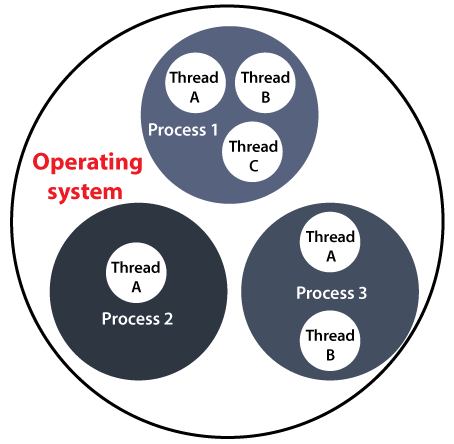

# Java - Collection

Collection trong Java là một framework cung cấp các cấu trúc dữ liệu và các thuật toán để lưu trữ và thao tác với nhóm các đối tượng (objects). Nó là một phần của Java Collection Framework JCF, nằm trong gói java.util. Collection giúp lập tình viên làm việc với các nhóm đối tượng một cách linh hoạt hiệu quả và dễ dàng hơn.

<figure><figcaption>
<a href="https://www.geeksforgeeks.org/java-collection-tutorial/?ref=shm">https://www.geeksforgeeks.org/java-collection-tutorial/?ref=shm</a>
</figcaption></figure>

## Các Interface chính trong Collection Framework

<table><thead><tr><th width="100">Sr.No.</th><th>Interface &#x26; Description</th></tr></thead><tbody><tr><td>1</td><td>
<a href="java-collection-interface.md">The Collection Interface</a>

Điều này cho phép bạn làm việc với các nhóm đối tượng; Nó nằm trên đỉnh của hệ thống phân cấp Collection.
</td></tr><tr><td>2</td><td>
<a href="java-list-interface.md">The List Interface</a>

Điều này mở rộng Collection và một thể hiện danh sách lưu trữ một Collection các yếu tố được sắp xếp.
</td></tr><tr><td>3</td><td>
<a href="java-set-interface.md">The Set</a>

Điều này mở rộng Collection để xử lý các sets, phải chứa các thành phần duy nhất.
</td></tr><tr><td>4</td><td>
<a href="java-sorted-set-interface.md">The SortedSet</a>

Điều này mở rộng thiết lập để xử lý các Sets đã được sắp xếp.
</td></tr><tr><td>5</td><td>
<a href="java-map-interface.md">The Map</a>

Ánh xạ các khóa duy nhất thành các giá trị.
</td></tr><tr><td>6</td><td>
<a href="java-sorted-map-interface.md">The SortedMap</a>

Điều này mở rộng Map để các khóa được duy trì theo thứ tự tăng dần.
</td></tr><tr><td>7</td><td><a href="java-queue-interface.md">The Queue</a> Giao diện hàng đợi được cung cấp trong gói java.util và nó triển khai giao diện Collection. Hàng đợi triển khai FIFO (First In First Out), nghĩa là các phần tử được đưa vào đầu tiên sẽ là những phần tử bị xóa đầu tiên.</td></tr></tbody></table>

### Java Collection Classes
