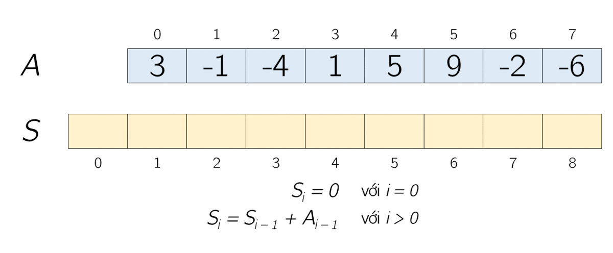

# 3. Prefix Sum & Kadane’s

## 1. Prefix Sum

<figure><figcaption></figcaption></figure>

### a. Định nghĩa

**Prefix Sum** (tích lũy tiền tố) là một kỹ thuật tiền xử lý cho dãy số, trong đó bạn tính toán một mảng phụ (prefix sum array) sao cho mỗi phần tử tại chỉ số `i` biểu thị tổng của các phần tử từ đầu dãy đến chỉ số `i` của mảng gốc.\
Công thức chung:

* Với mảng gốc `arr[0...n-1]`, ta định nghĩa mảng `P[0...n-1]` sao cho:
  * `P[0] = arr[0]`
  * `P[i] = P[i-1] + arr[i]` với `i ≥ 1`.

### b. Trường hợp ứng dụng

Kỹ thuật Prefix Sum được áp dụng phổ biến trong các bài toán:

* **Tính tổng dãy con nhanh chóng:**\
  Sau khi tính mảng prefix sum, tổng của dãy con từ `i` đến `j` có thể tính được trong thời gian O(1) với công thức:&#x20;

$$
\text{sum}(i, j) = P[j] - P[i-1] \quad (\text{với } i > 0), \quad \text{và } P[j] \quad (\text{nếu } i = 0)
$$

* **Giải quyết bài toán truy vấn tổng trên mảng:**\
  Rất hữu ích khi có nhiều truy vấn cần tính tổng dãy con.
* **Biến thể trong bài toán 2D Prefix Sum:**\
  Áp dụng cho ma trận (2D array) để tính tổng các vùng con trong ma trận một cách nhanh chóng.
* **Xử lý hiệu ứng chênh lệch:**\
  Đôi khi sử dụng kỹ thuật “difference array” (mảng hiệu) dựa trên prefix sum để cập nhật một khoảng giá trị trong mảng một cách hiệu quả.

### c. Chiến lược giải quyết bài toán với Prefix Sum

1. **Tiền xử lý:**
   * Tính mảng prefix sum `P` từ mảng gốc `arr` theo công thức:\
     `P[0] = arr[0]` và với mỗi `i` từ 1 đến n-1, `P[i] = P[i-1] + arr[i]`.
2. **Trả lời truy vấn:**
   * Với mỗi truy vấn yêu cầu tính tổng từ chỉ số `i` đến `j`, sử dụng công thức:
     * Nếu `i == 0`: tổng là `P[j]`.
     * Nếu `i > 0`: tổng là `P[j] - P[i-1]`.
3. **Xử lý các biến thể:**
   * Trong trường hợp cập nhật mảng thường xuyên, bạn có thể cần đến các cấu trúc dữ liệu khác như Segment Tree hoặc Binary Indexed Tree (Fenwick Tree) để duy trì prefix sum một cách hiệu quả.
   * Đối với ma trận 2D, xây dựng mảng 2D prefix sum và áp dụng công thức tương tự với các chỉ số hàng và cột.

***

## 2. Kadane’s Algorithm

### a. Định nghĩa

**Kadane’s Algorithm** là một thuật toán dùng để tìm chuỗi con liên tiếp có tổng lớn nhất trong một mảng số (có thể chứa số âm). Thuật toán hoạt động theo phương pháp “quyết định cục bộ” (local decision) để duy trì tổng liên tiếp tối ưu tại mỗi vị trí, từ đó cập nhật tổng lớn nhất toàn cục.

### b. Trường hợp ứng dụng

* **Tìm chuỗi con có tổng lớn nhất:**\
  Áp dụng cho các bài toán “Maximum Subarray Problem” (tìm dãy con có tổng lớn nhất).
* **Phát hiện chuỗi con có hiệu quả trong các bài toán tài chính:**\
  Ví dụ: tìm khoảng thời gian có lợi nhuận tối đa dựa trên thay đổi giá cổ phiếu.
* **Các bài toán tối ưu hóa tổng liên tiếp:**\
  Nhiều bài toán tối ưu có thể biến đổi về dạng tìm tổng lớn nhất của chuỗi con liên tiếp.

### c. Chiến lược giải quyết bài toán với Kadane’s Algorithm

1. **Khởi tạo:**
   * Giả sử mảng `arr` có `n` phần tử.
   * Đặt `current_sum = arr[0]` và `max_sum = arr[0]`.
2. **Duyệt qua mảng:**
   * Với mỗi phần tử `arr[i]` từ `i = 1` đến `n - 1`, thực hiện:
     * **Cập nhật `current_sum`:**\
       `current_sum = max(arr[i], current_sum + arr[i])`\
       Ý nghĩa: Nếu việc bắt đầu lại từ `arr[i]` (không cộng dồn chuỗi trước đó) cho tổng lớn hơn thì hãy khởi động lại chuỗi con tại đây.
     * **Cập nhật `max_sum`:**\
       `max_sum = max(max_sum, current_sum)`\
       Cập nhật giá trị tổng lớn nhất nếu `current_sum` mới tạo ra giá trị lớn hơn.
3. **Kết quả:**
   * Sau khi duyệt hết mảng, `max_sum` sẽ chứa tổng của chuỗi con liên tiếp có tổng lớn nhất.

### d. Một số lưu ý và biến thể

* **Tất cả các phần tử âm:**\
  Nếu mảng chỉ chứa số âm, thuật toán vẫn hoạt động đúng bằng cách trả về giá trị âm lớn nhất (ít âm nhất).
* **Theo dõi vị trí:**\
  Nếu cần in ra vị trí của chuỗi con (vị trí bắt đầu và kết thúc), có thể bổ sung các biến phụ để lưu chỉ số khi `current_sum` được cập nhật.
* **Biến thể 2D Kadane:**\
  Một biến thể của thuật toán Kadane được áp dụng cho mảng 2 chiều để tìm vùng con (submatrix) có tổng lớn nhất.

***

## Kết luận

* **Prefix Sum** là một kỹ thuật tiền xử lý mạnh mẽ giúp trả lời các truy vấn tổng dãy con một cách nhanh chóng sau khi tính toán ban đầu, đồng thời có thể được mở rộng sang các bài toán phức tạp hơn như 2D Prefix Sum.
* **Kadane’s Algorithm** cung cấp giải pháp tối ưu O(n) để tìm chuỗi con liên tiếp có tổng lớn nhất, áp dụng cho nhiều bài toán tối ưu hóa và xử lý chuỗi con trong mảng số.

Cả hai kỹ thuật đều rất hữu ích trong việc tối ưu hóa độ phức tạp thời gian và giải quyết bài toán hiệu quả. Nếu bạn cần ví dụ minh họa cụ thể hoặc có câu hỏi chi tiết hơn, hãy cho tôi biết để cùng cùng thảo luận sâu hơn!

