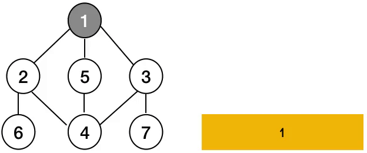

# 4. Binary tree DFS(Depth-First Search)

## 1. Định nghĩa

**DFS (Depth-First Search)** là một thuật toán duyệt cây (hoặc đồ thị) theo chiều sâu. Trong cây nhị phân, DFS bắt đầu từ nút gốc và đi sâu vào một nhánh cho đến khi không thể đi xa hơn, sau đó quay lại (backtracking) để duyệt các nhánh khác. DFS có thể được triển khai bằng đệ quy hoặc sử dụng cấu trúc dữ liệu ngăn xếp (stack) để mô phỏng quá trình đệ quy.

<figure><figcaption>
<a href="https://medium.com/@practicetracker4ever/depth-first-search-fd5900c20497">https://medium.com/@practicetracker4ever/depth-first-search-fd5900c20497</a>
</figcaption></figure>

Link visualize: [https://csvistool.com/DFS](https://csvistool.com/DFS)

***

## 2. Trường hợp ứng dụng

DFS trên cây nhị phân được áp dụng rộng rãi trong nhiều bài toán như:

* **Duyệt cây:**
  * Lấy ra các phần tử theo thứ tự nhất định (Preorder, Inorder, Postorder).
  * Duyệt và in ra toàn bộ các nút trong cây.
* **Tìm kiếm và truy vấn:**
  * Tìm kiếm một nút có giá trị cụ thể.
  * Kiểm tra sự tồn tại của đường đi hay một cấu trúc con trong cây.
* **Giải quyết bài toán liên quan đến đường đi:**
  * Tìm đường từ gốc đến các lá.
  * Tính toán tổng hoặc giá trị tối ưu của đường đi (ví dụ: bài toán Path Sum).
* **Các bài toán sử dụng kỹ thuật Backtracking:**
  * Sinh tất cả các đường đi có thể từ gốc đến lá.
  * Giải các bài toán liên quan đến cấu trúc cây, ví dụ như tìm cây con cân bằng, cây con có tổng giá trị lớn nhất,…

***

## 3. Dạng phổ biến

#### a. Các thứ tự duyệt cây với DFS

* **Preorder (NLR - Node, Left, Right):**
  * Thứ tự: Gốc → Con trái → Con phải.
  * Ứng dụng: Dùng để sao chép cây, chuyển đổi cấu trúc cây sang dạng khác.
* **Inorder (LNR - Left, Node, Right):**
  * Thứ tự: Con trái → Gốc → Con phải.
  * Ứng dụng: Đối với cây tìm kiếm nhị phân (BST), duyệt theo Inorder cho ra các giá trị theo thứ tự tăng dần.
* **Postorder (LRN - Left, Right, Node):**
  * Thứ tự: Con trái → Con phải → Gốc.
  * Ứng dụng: Dùng để giải phóng bộ nhớ khi xóa cây, hay tính toán giá trị của cây biểu thức.

#### b. Các cách triển khai

* **Đệ quy:**
  * Cách triển khai đơn giản và trực quan, tự động quản lý ngăn xếp thông qua call stack.
* **Sử dụng ngăn xếp (Iterative):**
  * Thích hợp khi muốn kiểm soát rõ ràng quá trình duyệt hoặc tránh giới hạn của call stack trong trường hợp cây quá sâu.

***

## 4. Chiến lược giải quyết bài toán với Binary Tree DFS

1. **Xác định mục tiêu bài toán:**
   * Bài toán yêu cầu duyệt toàn bộ cây, tìm kiếm một nút, hoặc tính toán thông tin từ các nút (tổng, chiều sâu, số lượng nút, …).
2. **Chọn kiểu duyệt phù hợp:**
   * Lựa chọn Preorder, Inorder, hoặc Postorder tùy theo yêu cầu của bài toán.
   * Nếu bài toán yêu cầu xử lý thông tin ngay khi đến nút gốc trước khi duyệt các con, Preorder sẽ phù hợp. Ngược lại, nếu cần xử lý thông tin sau khi duyệt các con, Postorder có thể là lựa chọn thích hợp.
3. **Triển khai thuật toán:**
   * **Đệ quy:**
     * Xác định điều kiện dừng (nút rỗng).
     * Thực hiện gọi đệ quy cho con trái và con phải theo thứ tự đã chọn.
   * **Sử dụng ngăn xếp:**
     * Khởi tạo stack với nút gốc.
     * Trong khi stack không rỗng, pop phần tử trên cùng, xử lý nó và push các nút con vào stack theo thứ tự phù hợp (lưu ý thứ tự push có thể ảnh hưởng đến thứ tự duyệt).
4. **Xử lý các trường hợp đặc biệt và tối ưu hóa:**
   * Kiểm tra điều kiện rỗng ngay từ đầu (nếu cây không có nút nào).
   * Trong một số bài toán, cần lưu trữ thông tin bổ sung (ví dụ: đường đi hiện tại, chiều sâu, …) trong quá trình duyệt.
   * Sử dụng kỹ thuật backtracking để quay lại trạng thái trước đó khi cần thiết (đặc biệt trong các bài toán tìm đường đi hay tập hợp con).

