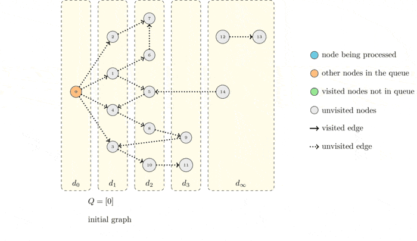

# 5. Binary tree BFS(Breath-First Search)

## 1. Định nghĩa

**BFS (Breadth-First Search)** trên cây nhị phân là kỹ thuật duyệt cây theo chiều rộng, nghĩa là duyệt các nút theo từng cấp (level) từ trên xuống dưới và từ trái sang phải. Thuật toán sử dụng cấu trúc dữ liệu **hàng đợi (queue)** để theo dõi các nút cần duyệt, đảm bảo rằng các nút ở cùng một cấp được xử lý trước khi chuyển sang cấp tiếp theo.

<figure><figcaption><p><a href="https://inginious.org/course/competitive-programming/graphs-bfs">https://inginious.org/course/competitive-programming/graphs-bfs</a></p></figcaption></figure>

Link visual: [https://csvistool.com/BFS](https://csvistool.com/BFS)

***

## 2. Trường hợp ứng dụng

Kỹ thuật BFS trên cây nhị phân được áp dụng trong nhiều bài toán, chẳng hạn:

* **Duyệt cây theo level (Level Order Traversal):**
  * Lấy ra các nút theo thứ tự từng cấp.
  * In ra hoặc xử lý thông tin của cây theo cấp độ.
* **Tìm kiếm theo chiều rộng:**
  * Tìm kiếm một nút hoặc một giá trị cụ thể trong cây.
  * Tìm đường đi ngắn nhất trong cây (trong các trường hợp ứng dụng cây như đồ thị không có trọng số).
* **Các bài toán liên quan đến độ sâu của cây:**
  * Tính chiều cao của cây.
  * Tính tổng, trung bình của các nút tại từng cấp.
* **Serialization/Deserialization cây:**
  * Biến cây thành chuỗi theo dạng level order để lưu trữ hoặc truyền tải, sau đó khôi phục lại cây từ chuỗi.

***

## 3. Dạng phổ biến

#### a. Level Order Traversal

* **Mô tả:**\
  Duyệt cây theo từng cấp, từ gốc đến lá, từ trái qua phải.
* **Phương pháp:**
  * **Sử dụng hàng đợi (queue):**
    * Bắt đầu với nút gốc đưa vào hàng đợi.
    * Trong khi hàng đợi không rỗng, lấy ra nút ở đầu, xử lý nó, sau đó đưa các nút con (trái và phải) của nút đó vào hàng đợi.
* **Ví dụ minh họa:**
  *   Cho cây:

      ```
            1
           / \
          2   3
         / \   \
        4   5   6
      ```

      Duyệt BFS sẽ cho ra thứ tự: 1 → 2 → 3 → 4 → 5 → 6.

***

## 4. Chiến lược giải quyết bài toán với Binary Tree BFS

1.  **Khởi tạo hàng đợi:**

    Tạo một hàng đợi và thêm vào nút gốc của cây (nếu cây không rỗng).
2.  **Duyệt theo cấp:**

    Trong khi hàng đợi không rỗng:

    * **Xác định số lượng nút của cấp hiện tại:** Lấy kích thước của hàng đợi (số nút của cấp hiện tại).
    * **Xử lý từng nút của cấp:**
      * Lặp qua từng nút trong cấp hiện tại, pop từ hàng đợi, xử lý (ví dụ: in giá trị, thêm vào danh sách kết quả, …).
      * Thêm các nút con (nếu có) của nút vừa pop vào hàng đợi.
3.  **Cập nhật kết quả:**\


    Tùy vào yêu cầu của bài toán, bạn có thể lưu lại các giá trị theo cấp, tính toán số lượng nút, tổng giá trị, hoặc kiểm tra điều kiện dừng sớm (nếu tìm thấy nút cần tìm).\

4. **Xử lý các trường hợp đặc biệt:**
   * Kiểm tra cây rỗng ngay từ đầu.
   * Xử lý đúng thứ tự duyệt (đảm bảo thứ tự từ trái sang phải nếu cần).
5. **Độ phức tạp:**
   * Thời gian: O(n) với n là số nút của cây.
   * Không gian: O(n) trong trường hợp xấu nhất khi hàng đợi chứa toàn bộ nút của một cấp (có thể xảy ra ở cây cân bằng).

## 5. Code

```python
# Định nghĩa cấu trúc của một nút trong cây nhị phân
class TreeNode:
    def __init__(self, val=0, left=None, right=None):
        self.val = val      # Giá trị của nút
        self.left = left    # Con trái của nút
        self.right = right  # Con phải của nút

def bfs_level_order(root):
    """
    Hàm duyệt cây theo cấp (BFS - Level Order Traversal)
    Trả về danh sách các cấp, mỗi cấp là danh sách giá trị của các nút trong cấp đó.
    """
    # Nếu cây rỗng, trả về danh sách rỗng
    if not root:
        return []
    
    result = []        # Danh sách kết quả chứa các cấp của cây
    queue = [root]     # Khởi tạo hàng đợi với nút gốc

    # Lặp cho đến khi hàng đợi rỗng
    while queue:
        level_size = len(queue)  # Số lượng nút ở cấp hiện tại
        level_nodes = []         # Danh sách tạm thời lưu giá trị của các nút ở cấp hiện tại
        
        # Xử lý tất cả các nút trong cấp hiện tại
        for _ in range(level_size):
            # Lấy phần tử đầu tiên trong hàng đợi
            node = queue.pop(0)
            # Thêm giá trị của nút vào danh sách của cấp hiện tại
            level_nodes.append(node.val)
            
            # Nếu nút có con trái, thêm nó vào hàng đợi
            if node.left:
                queue.append(node.left)
            # Nếu nút có con phải, thêm nó vào hàng đợi
            if node.right:
                queue.append(node.right)
                
        # Sau khi duyệt xong cấp hiện tại, thêm danh sách giá trị vào kết quả
        result.append(level_nodes)
        
    return result

# Ví dụ sử dụng hàm BFS để duyệt cây
if __name__ == "__main__":
    # Tạo một cây nhị phân ví dụ:
    #         1
    #       /   \
    #      2     3
    #     / \     \
    #    4   5     6
    root = TreeNode(1)
    root.left = TreeNode(2)
    root.right = TreeNode(3)
    root.left.left = TreeNode(4)
    root.left.right = TreeNode(5)
    root.right.right = TreeNode(6)
    
    # Gọi hàm BFS và in kết quả
    levels = bfs_level_order(root)
    print("Level Order Traversal của cây:")
    for level in levels:
        print(level)
```

#### Giải thích chung:

* **TreeNode Class:** Định nghĩa cấu trúc của một nút trong cây nhị phân với giá trị và liên kết đến con trái, con phải.
* **bfs\_level\_order Function:** Hàm thực hiện duyệt BFS. Sử dụng một hàng đợi để lưu các nút cần xử lý theo thứ tự từ trên xuống dưới (theo cấp).
* **Queue:** Khởi tạo với nút gốc, sau đó liên tục lấy từng nút ra, xử lý, và đưa các nút con vào hàng đợi.
* **Level Order:** Mỗi vòng lặp của `while` xử lý một cấp của cây, thu thập các giá trị của các nút trong cấp đó và thêm vào kết quả.


***

## Kết luận

**Binary Tree - BFS** là một phương pháp duyệt cây hiệu quả để xử lý các bài toán liên quan đến cây theo cấp độ. Với việc sử dụng hàng đợi, BFS đảm bảo duyệt theo thứ tự từ trên xuống dưới, từ trái sang phải, rất hữu ích cho các bài toán như duyệt theo level, tìm kiếm, và tính toán thông tin theo cấp của cây.

Nếu bạn có câu hỏi cụ thể hay cần ví dụ minh họa chi tiết hơn về Binary Tree - BFS, hãy cho tôi biết để cùng nhau thảo luận thêm!
